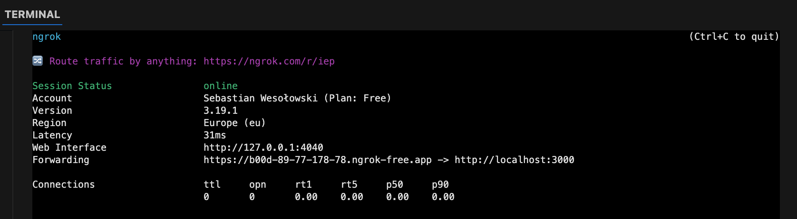
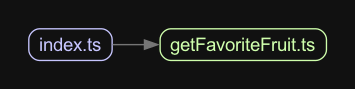

# S-NestJS-Module-LLM

Moduł NestJS do integracji z OpenAI API.

## Dokumentacja

Pełna dokumentacja modułu jest dostępna w katalogu [docs](./docs/index.md).

## Funkcje

- Integracja z API OpenAI
- Konwersja mowy na tekst
- Generowanie tekstu na podstawie promptów
- Analiza obrazów
- Obsługa JSON-owych odpowiedzi

## Instalacja

```bash
npm install s-nestjs-module-llm
```

## Przykład użycia

```typescript
import { Module } from '@nestjs/common';
import { ConfigModule, ConfigService } from '@nestjs/config';
import { LLMModule } from 's-nestjs-module-llm';

@Module({
  imports: [
    ConfigModule.forRoot(),
    LLMModule.forRootAsync({
      useFactory: (configService: ConfigService) => ({
        apiKey: configService.get('OPENAI_API_KEY'),
        logPrompts: configService.get('LOG_PROMPTS') === 'true',
        logPath: configService.get('LOG_PATH'),
      }),
      inject: [ConfigService],
    }),
  ],
})
export class AppModule {}
```

## Important Links

- [![npm package][npm-img]][npm-url]
- [![Build Status][build-img]][build-url]
- [![GitHub Contributors][github-contributors-badge]][github-contributors-badge-link]
- [Author page]({{PLACEHOLDER_PAGE_AUTHOR}})
- [Git Hooks Documentation](.husky/README.md)

<br/><br/>

**Remove before final release**

- [Set up your repository](docs/HowToAutoDeploy.md)
- [Way to work](docs/WayToWrok.md)
- [Known issues](docs/knowProblems.md)

---

<br/>

A submodule for nestjs, with features like a llm

## Swagger

Go to localhost:3000/docs

## Example API

Po uruchomieniu aplikacji, możesz przetestować API używając poniższych endpointów:

- `GET /api/start` - Zwraca dane startowe, w tym listę użytkowników
- `GET /api/user/:id` - Zwraca dane pojedynczego użytkownika

### Przykłady użycia

#### Pobieranie danych startowych:

```bash
curl http://localhost:3000/api/start
```

#### Pobieranie danych użytkownika:

```bash
curl http://localhost:3000/api/user/9b1deb4d-3b7d-4bad-9bdd-2b0d7b3dcb6d
```

## Generowanie schematów dla frontendu

Aby wygenerować schematy dla aplikacji frontendowej:

```bash
npm run zod:generate
```

Schematy zostaną wygenerowane w katalogu `../frontend/types/zod-schemas`.

### Integrated features

Don't worry, with this template you will anyways get all the awesomeness you need:

- 📦 **[s-update-manager](https://github.com/SebastianWesolowski/s-update-manager)** - Manage your dependencies with centralized repozystory
- 🎨 **[s-customize](https://github.com/SebastianWesolowski/s-template/tools/customize)** - Customize your repozytory with one command
- 🌐 **[ngrok](https://ngrok.com/)** - For local development with remote services
- ✨ **[ESlint](https://eslint.org/)** and **[Prettier](https://prettier.io/)** - For clean, consistent, and error-free code
- 🛠️ **[Extremely strict TypeScript](https://www.typescriptlang.org/)** - With [`ts-reset`](https://github.com/total-typescript/ts-reset) library for ultimate type safety
- 🚀 **[GitHub Actions](https://github.com/features/actions)** - Pre-configured actions for smooth workflows, including Bundle Size and performance stats
- **[Jest](https://jestjs.io/)** - For rock-solid unit and integration tests
- **Smoke Testing** and **Acceptance Tests** - For confidence in your deployments
- **[Conventional commits git hook](https://www.conventionalcommits.org/)** - Keep your commit history neat and tidy
- **[Absolute imports](https://nextjs.org/docs/advanced-features/module-path-aliases)** - No more spaghetti imports
- **[Patch-package](https://www.npmjs.com/package/patch-package)** - Fix external dependencies without losing your mind
- **Components coupling and cohesion graph** - A tool for managing component relationships
- **[Semantic Release](https://github.com/semantic-release/semantic-release)** - for automatic changelog
- **[Husky](https://typicode.github.io/husky/)** - Git hooks made easy (see [Git Hooks Documentation](.husky/README.md))

## 🎯 Getting Started

To get started with this boilerplate, follow these steps:

1. Install the dependencies:

```bash
yarn install
```

2. Run the update witch s-update-manager:

```bash
yarn s-update-manager
```

3. Set up your repository

Replace variable in the `./tools/customize/customize.config.ts` script with your own details to personalize your new package:

```bash
export const config: CustomizeConfig = {
  replacements: [
    {
      placeholder: "{{PLACEHOLDER_FULL_NAME_EXAMPLE}}",
      value: "Sebastian Wesolowski",
      files: [
        "package.json",
        "README.md",
        "./docs/HowToAutoDeploy.md",
        ".github/FUNDING.yml",
      ],
    },
    {
      placeholder: "{{PLACEHOLDER_PAGE_AUTHOR_EXAMPLE}}",
      value: "www.wesolowski.dev",
      files: [".github/FUNDING.yml", "package.json", "LICENSE"],
    },
    ...
```

You can look on example in `./tools/customize/customize.example.config.ts`

Run script with:

```bash
yarn customize
```

or

```bash
tsx tools/customize/customize.ts
```

4. Optional

- 4.1. Add ngrok token in .env file for local development

  ```bash
   NGROK_AUTH_TOKEN=your_ngrok_token
  ```

  after that you can run ngrok to expose your local server to the internet:

  ```bash
    yarn dev:tunnel
  ```

  [](https://dashboard.ngrok.com/get-started/setup/macos)

5. Run the development server:

## Deployment

```bash
# unit tests
$ npm run test

# e2e tests
$ npm run test:e2e

# test coverage
$ npm run test:cov
```

When you're ready to deploy your NestJS application to production, there are some key steps you can take to ensure it runs as efficiently as possible. Check out the [deployment documentation](https://docs.nestjs.com/deployment) for more information.

If you are looking for a cloud-based platform to deploy your NestJS application, check out [Mau](https://mau.nestjs.com), our official platform for deploying NestJS applications on AWS. Mau makes deployment straightforward and fast, requiring just a few simple steps:

```bash
$ npm install -g mau
$ mau deploy
```

With Mau, you can deploy your application in just a few clicks, allowing you to focus on building features rather than managing infrastructure.

```bash
yarn dev
```

## 🔗 Coupling Graph

The `coupling-graph` script is a useful tool that helps visualize the coupling and connections between your project's internal modules. It's built using the [Madge](https://github.com/pahen/madge) library. To generate the graph, simply run the following command:

```bash
yarn coupling-graph
```

This will create a `graph.svg` file, which contains a graphical representation of the connections between your components. You can open the file with any SVG-compatible viewer.



## Badges

[![Downloads][downloads-img]][downloads-url]
[![Issues][issues-img]][issues-url]
[![Commitizen Friendly][commitizen-img]][commitizen-url]
[![Semantic Release][semantic-release-img]][semantic-release-url]
[![GitHub License][github-license-badge]][github-license-badge-link]

[build-img]: https://github.com/SebastianWesolowski/s-nestjs-module-llm/actions/workflows/release.yml/badge.svg
[build-url]: https://github.com/SebastianWesolowski/s-nestjs-module-llm/actions/workflows/release.yml
[downloads-img]: https://img.shields.io/npm/dt/s-nestjs-module-llm
[downloads-url]: https://www.npmtrends.com/s-nestjs-module-llm
[npm-img]: https://img.shields.io/npm/v/s-nestjs-module-llm
[npm-url]: https://www.npmjs.com/package/s-nestjs-module-llm
[issues-img]: https://img.shields.io/github/issues/SebastianWesolowski/s-nestjs-module-llm
[issues-url]: https://github.com/SebastianWesolowski/s-nestjs-module-llm/issues
[semantic-release-img]: https://img.shields.io/badge/%20%20%F0%9F%93%A6%F0%9F%9A%80-semantic--release-e10079.svg
[semantic-release-url]: https://github.com/semantic-release/semantic-release
[commitizen-img]: https://img.shields.io/badge/commitizen-friendly-brightgreen.svg
[commitizen-url]: http://commitizen.github.io/cz-cli/
[github-license-badge]: https://img.shields.io/github/license/SebastianWesolowski/s-nestjs-module-llm
[github-license-badge-link]: https://github.com/SebastianWesolowski/s-nestjs-module-llm/blob/main/LICENSE
[github-contributors-badge]: https://img.shields.io/github/contributors/SebastianWesolowski/s-nestjs-module-llm
[github-contributors-badge-link]: https://github.com/SebastianWesolowski/s-nestjs-module-llm/graphs/contributors
